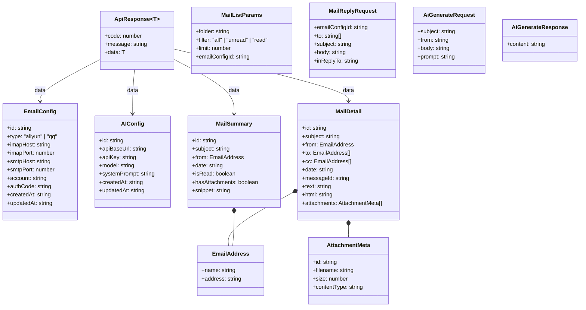
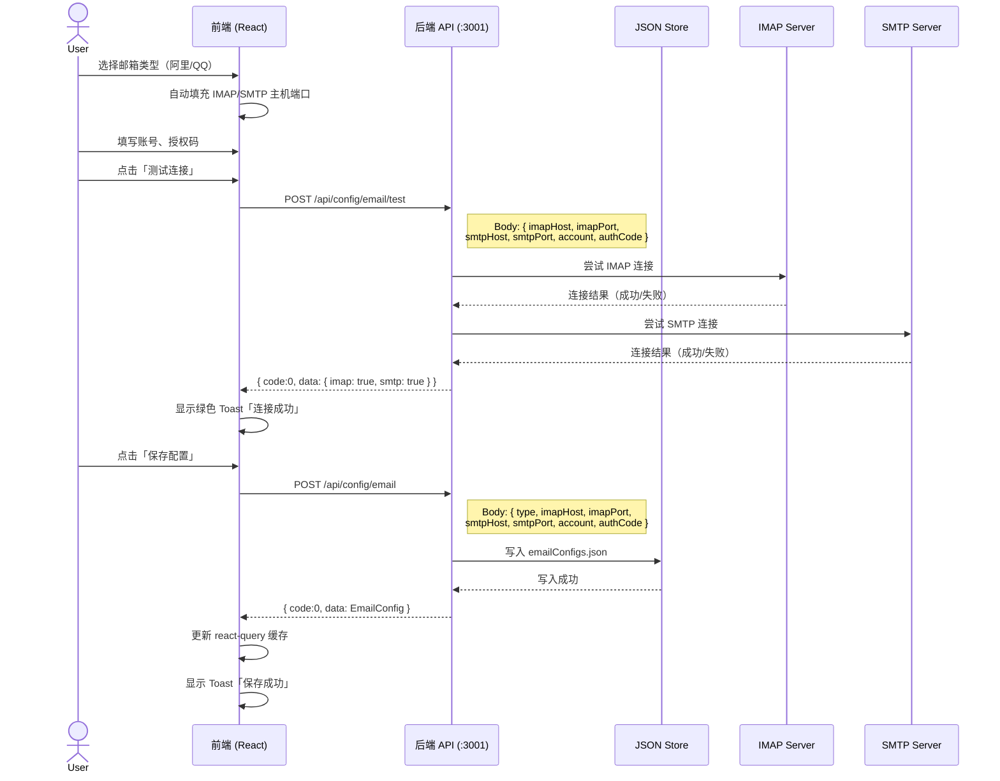
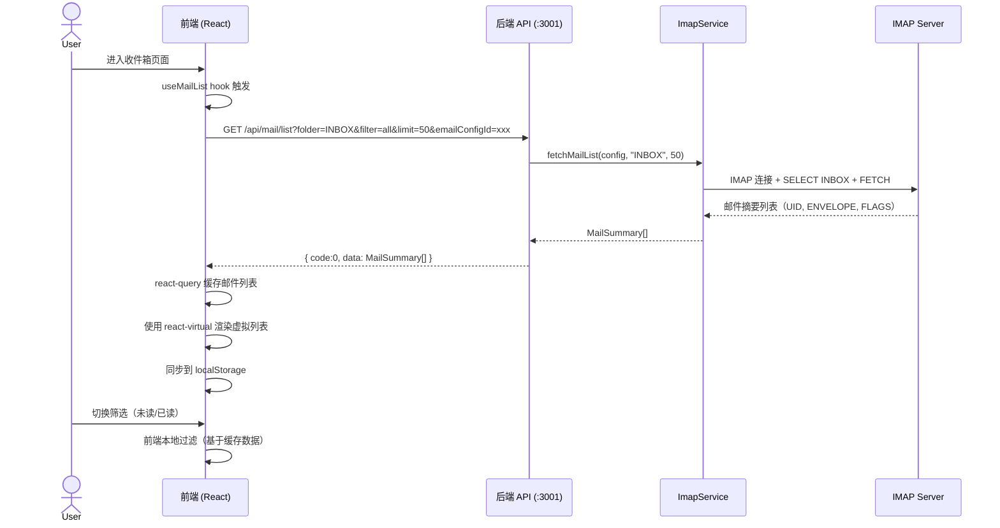
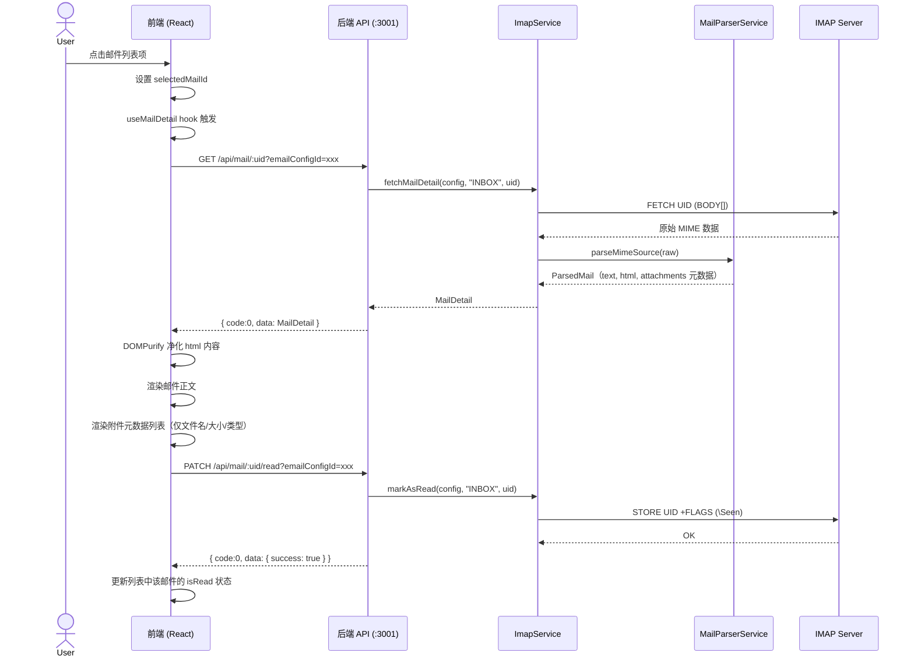
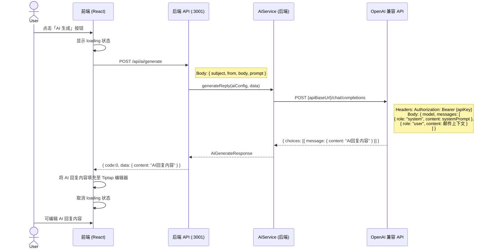
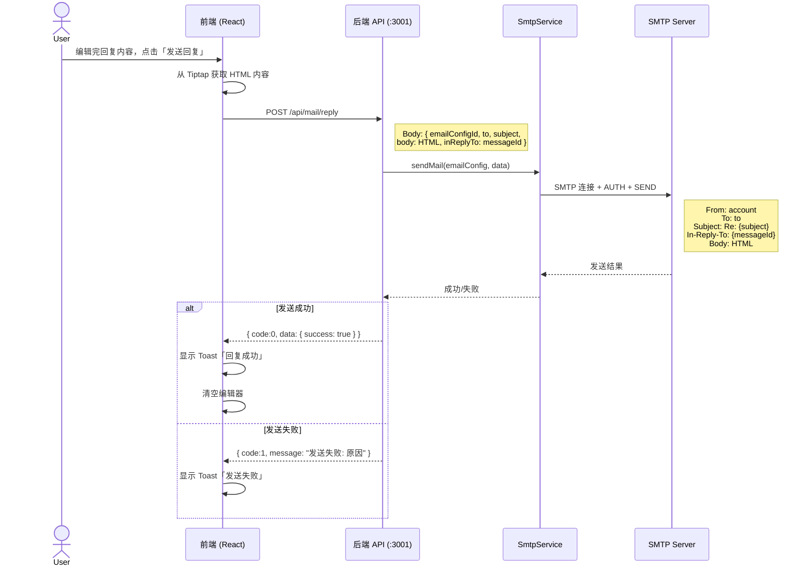
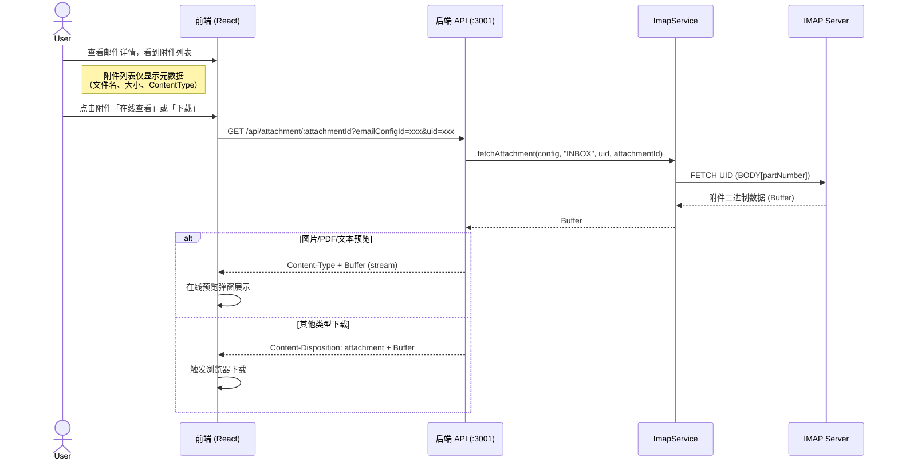

# Prompt-Mail 系统架构设计文档

> **项目名称**：Prompt-Mail — 第三方邮箱接入与 AI 辅助邮件系统
> **文档版本**：v1.0.0
> **创建日期**：2026-05-05
> **架构师**：高见远（Gao）

---

## 一、实现方案

### 1.1 前端架构设计

#### 1.1.1 路由设计

使用 React Router 7.x（或 react-router-dom v7），采用 HashRouter 以兼容本地静态部署。

| 路径 | 组件 | 说明 |
|------|------|------|
| `/` | 重定向到 `/inbox` | 默认入口 |
| `/inbox` | `InboxPage` | 邮件列表+详情页 |
| `/settings` | `SettingsPage` | 配置页（邮箱+AI） |

#### 1.1.2 状态管理

采用 **@tanstack/react-query** 管理服务端状态（邮件列表、配置数据），**React Context + useReducer** 管理客户端 UI 状态（当前选中邮件、筛选条件等），**localStorage** 做持久化缓存。

- **服务端状态**：react-query 缓存邮件列表、邮件详情、邮箱配置、AI 配置
- **UI 状态**：MailContext 管理当前选中邮件ID、筛选条件（all/unread/read）、当前邮箱ID
- **持久化缓存**：通过 react-query 的 `persister` 或手动同步 localStorage

#### 1.1.3 组件层次

```
App
├── AppLayout                    // 全局布局（Header + Content）
│   ├── AppHeader                // 顶部导航：Logo + 当前邮箱 + 设置入口
│   └── <Routes>
│       ├── InboxPage            // 邮件列表页
│       │   ├── MailListPanel    // 左侧邮件列表
│       │   │   ├── MailFilterBar    // 筛选栏（全部/未读/已读 + 刷新）
│       │   │   └── MailList         // 虚拟滚动邮件列表
│       │   │       └── MailListItem // 单封邮件项
│       │   └── MailDetailPanel  // 右侧邮件详情+回复
│       │       ├── MailDetailHeader  // 发件人/日期/主题
│       │       ├── MailDetailBody    // 邮件正文（DOMPurify 净化）
│       │       ├── MailAttachments   // 附件列表
│       │       │   └── AttachmentItem // 单个附件（按需下载/预览）
│       │       └── MailReplyEditor   // Tiptap 回复编辑器
│       │           ├── AiGenerateBtn // AI 生成按钮
│       │           └── SendReplyBtn  // 发送回复按钮
│       └── SettingsPage         // 配置页
│           ├── EmailConfigCard  // 邮箱配置卡片
│           └── AiConfigCard     // AI 配置卡片
```

### 1.2 后端架构设计

#### 1.2.1 技术选型

- **框架**：Express 5.x（轻量、生态成熟）
- **端口**：默认 3001（可通过环境变量 `PORT` 配置）
- **数据持久化**：JSON 文件存储（`server/data/` 目录），零数据库依赖

#### 1.2.2 分层架构

```
Controller 层（路由处理、参数校验）
    ↓
Service 层（业务逻辑）
    ↓
Store 层（数据持久化）
```

- **Controller**：接收请求、参数校验、调用 Service、返回响应
- **Service**：核心业务逻辑（IMAP 连接、SMTP 发送、AI 调用、MIME 解析）
- **Store**：JSON 文件读写，提供类似 Repository 的接口

#### 1.2.3 中间件

| 中间件 | 说明 |
|--------|------|
| `express.json()` | 请求体 JSON 解析 |
| `cors()` | 跨域支持（开发模式） |
| `errorHandler` | 全局错误处理，统一返回 `{ code, message, data }` 格式 |
| `requestLogger` | 请求日志（开发模式） |

### 1.3 前后端通信机制

- **开发模式**：Vite dev server 的 proxy 将 `/api` 请求代理到 `http://localhost:3001`
- **通信格式**：RESTful JSON，统一响应格式：

```typescript
interface ApiResponse<T = unknown> {
  code: number       // 0 成功，非0 失败
  message: string    // 描述信息
  data: T            // 业务数据
}
```

- **错误处理**：Axios 拦截器统一处理 HTTP 错误码和业务错误码，antd message 全局提示

---

## 二、文件列表及相对路径

### 2.1 项目根目录配置文件

```
prompt-mail/
├── package.json                  # 项目依赖与脚本
├── tsconfig.json                 # TypeScript 配置
├── tsconfig.node.json            # Node 端 TypeScript 配置
├── vite.config.ts                # Vite 配置（oxc + proxy）
├── uno.config.ts                 # UnoCSS 配置
├── index.html                    # 入口 HTML
├── .gitignore
└── .env                          # 环境变量（PORT=3001 等）
```

### 2.2 前端文件（src/）

```
src/
├── main.tsx                      # React 入口
├── App.tsx                       # 根组件（路由 + Provider）
├── vite-env.d.ts                 # Vite 类型声明
│
├── assets/                       # 静态资源
│   └── logo.svg
│
├── components/                   # 通用组件
│   ├── AppLayout/
│   │   └── index.tsx             # 全局布局
│   ├── AppHeader/
│   │   └── index.tsx             # 顶部导航
│   └── Loading/
│       └── index.tsx             # 加载状态组件
│
├── pages/                        # 页面组件
│   ├── InboxPage/
│   │   └── index.tsx             # 邮件列表页（组装左右面板）
│   └── SettingsPage/
│       └── index.tsx             # 配置页（组装邮箱+AI卡片）
│
├── features/                     # 功能模块（按领域划分）
│   ├── mail/                     # 邮件模块
│   │   ├── components/
│   │   │   ├── MailListPanel/
│   │   │   │   └── index.tsx         # 左侧邮件列表面板
│   │   │   ├── MailList/
│   │   │   │   └── index.tsx         # 虚拟滚动邮件列表
│   │   │   ├── MailListItem/
│   │   │   │   └── index.tsx         # 邮件列表项
│   │   │   ├── MailFilterBar/
│   │   │   │   └── index.tsx         # 筛选栏
│   │   │   ├── MailDetailPanel/
│   │   │   │   └── index.tsx         # 右侧详情面板
│   │   │   ├── MailDetailHeader/
│   │   │   │   └── index.tsx         # 详情头部
│   │   │   ├── MailDetailBody/
│   │   │   │   └── index.tsx         # 邮件正文（DOMPurify）
│   │   │   ├── MailAttachments/
│   │   │   │   └── index.tsx         # 附件列表
│   │   │   ├── AttachmentItem/
│   │   │   │   └── index.tsx         # 单个附件项
│   │   │   ├── AttachmentPreview/
│   │   │   │   └── index.tsx         # 附件在线预览弹窗
│   │   │   └── MailReplyEditor/
│   │   │       └── index.tsx         # Tiptap 回复编辑器
│   │   ├── hooks/
│   │   │   ├── useMailList.ts        # 邮件列表查询 hook
│   │   │   ├── useMailDetail.ts      # 邮件详情查询 hook
│   │   │   ├── useMailReply.ts       # 回复邮件 mutation hook
│   │   │   ├── useMarkRead.ts        # 标记已读 mutation hook
│   │   │   └── useAttachment.ts      # 附件下载 hook
│   │   └── context/
│   │       └── MailContext.tsx        # 邮件 UI 状态 Context
│   │
│   ├── config/                   # 配置模块
│   │   ├── components/
│   │   │   ├── EmailConfigCard/
│   │   │   │   └── index.tsx         # 邮箱配置卡片
│   │   │   └── AiConfigCard/
│   │   │       └── index.tsx         # AI 配置卡片
│   │   └── hooks/
│   │       ├── useEmailConfig.ts     # 邮箱配置 CRUD hook
│   │       └── useAiConfig.ts        # AI 配置 CRUD hook
│   │
│   └── ai/                       # AI 模块
│       ├── components/
│       │   └── AiGenerateBtn/
│       │       └── index.tsx         # AI 生成按钮
│       └── hooks/
│           └── useAiGenerate.ts      # AI 生成回复 hook
│
├── services/                     # API 请求层
│   ├── request.ts                # Axios 实例与拦截器
│   ├── emailConfigService.ts     # 邮箱配置 API
│   ├── aiConfigService.ts        # AI 配置 API
│   ├── mailService.ts            # 邮件操作 API
│   ├── attachmentService.ts      # 附件 API
│   └── aiService.ts              # AI 生成 API
│
├── stores/                       # 客户端状态
│   └── index.ts                  # react-query client 配置 + localStorage persister
│
├── types/                        # 类型定义
│   ├── emailConfig.ts            # 邮箱配置类型
│   ├── aiConfig.ts               # AI 配置类型
│   ├── mail.ts                   # 邮件相关类型
│   └── api.ts                    # API 响应通用类型
│
└── utils/                        # 工具函数
    ├── sanitizer.ts              # DOMPurify 封装
    ├── emailPresets.ts           # 邮箱预设（阿里/QQ IMAP/SMTP）
    └── localStorage.ts           # localStorage 封装
```

### 2.3 后端文件（server/）

```
server/
├── index.ts                      # 入口：创建 Express 应用、注册中间件和路由、启动监听
│
├── routes/                       # 路由层
│   ├── index.ts                  # 路由汇总注册
│   ├── emailConfigRoutes.ts      # /api/config/email 路由
│   ├── aiConfigRoutes.ts         # /api/config/ai 路由
│   ├── mailRoutes.ts             # /api/mail 路由
│   ├── attachmentRoutes.ts       # /api/attachment 路由
│   └── aiRoutes.ts               # /api/ai 路由
│
├── controllers/                  # 控制器层
│   ├── emailConfigController.ts  # 邮箱配置控制器
│   ├── aiConfigController.ts     # AI 配置控制器
│   ├── mailController.ts         # 邮件控制器
│   ├── attachmentController.ts   # 附件控制器
│   └── aiController.ts           # AI 控制器
│
├── services/                     # 服务层
│   ├── imapService.ts            # IMAP 连接与邮件拉取（imapflow）
│   ├── smtpService.ts            # SMTP 发送（nodemailer）
│   ├── mailParserService.ts      # MIME 解析（mailparser）
│   ├── aiService.ts              # AI API 调用
│   └── attachmentService.ts      # 附件处理
│
├── stores/                       # 数据持久化层
│   ├── emailConfigStore.ts       # 邮箱配置 JSON 存储
│   └── aiConfigStore.ts          # AI 配置 JSON 存储
│
├── middlewares/                   # 中间件
│   ├── errorHandler.ts           # 全局错误处理
│   └── requestLogger.ts          # 请求日志
│
├── types/                        # 类型定义
│   └── index.ts                  # 后端所有类型定义
│
├── data/                         # JSON 数据文件
│   ├── emailConfigs.json         # 邮箱配置数据
│   └── aiConfigs.json            # AI 配置数据
│
└── utils/                        # 工具函数
    └── response.ts               # 统一响应格式封装
```

---

## 三、数据结构和接口（类图）



### 3.1 前端 Service 层接口

```typescript
// services/emailConfigService.ts
interface IEmailConfigService {
  getEmailConfig(): Promise<ApiResponse<EmailConfig[]>>
  saveEmailConfig(config: Omit<EmailConfig, 'id' | 'createdAt' | 'updatedAt'>): Promise<ApiResponse<EmailConfig>>
  testEmailConnection(config: Pick<EmailConfig, 'imapHost' | 'imapPort' | 'smtpHost' | 'smtpPort' | 'account' | 'authCode'>): Promise<ApiResponse<{ imap: boolean; smtp: boolean }>>
}

// services/aiConfigService.ts
interface IAiConfigService {
  getAiConfig(): Promise<ApiResponse<AIConfig[]>>
  saveAiConfig(config: Omit<AIConfig, 'id' | 'createdAt' | 'updatedAt'>): Promise<ApiResponse<AIConfig>>
  testAiConnection(config: Pick<AIConfig, 'apiBaseUrl' | 'apiKey' | 'model'>): Promise<ApiResponse<{ success: boolean; message: string }>>
}

// services/mailService.ts
interface IMailService {
  getMailList(params: MailListParams): Promise<ApiResponse<MailSummary[]>>
  getMailDetail(id: string, emailConfigId: string): Promise<ApiResponse<MailDetail>>
  replyMail(data: MailReplyRequest): Promise<ApiResponse<{ success: boolean }>>
  markAsRead(id: string, emailConfigId: string): Promise<ApiResponse<{ success: boolean }>>
}

// services/attachmentService.ts
interface IAttachmentService {
  getAttachmentUrl(id: string): string  // 返回下载 URL
}

// services/aiService.ts
interface IAiService {
  generateReply(data: AiGenerateRequest): Promise<ApiResponse<AiGenerateResponse>>
}
```

### 3.2 后端 Controller 层接口

```typescript
// controllers/emailConfigController.ts
interface IEmailConfigController {
  getEmailConfig(req: Request, res: Response): Promise<void>
  saveEmailConfig(req: Request, res: Response): Promise<void>
  testEmailConnection(req: Request, res: Response): Promise<void>
}

// controllers/aiConfigController.ts
interface IAiConfigController {
  getAiConfig(req: Request, res: Response): Promise<void>
  saveAiConfig(req: Request, res: Response): Promise<void>
  testAiConnection(req: Request, res: Response): Promise<void>
}

// controllers/mailController.ts
interface IMailController {
  getMailList(req: Request, res: Response): Promise<void>
  getMailDetail(req: Request, res: Response): Promise<void>
  replyMail(req: Request, res: Response): Promise<void>
  markAsRead(req: Request, res: Response): Promise<void>
}

// controllers/attachmentController.ts
interface IAttachmentController {
  downloadAttachment(req: Request, res: Response): Promise<void>
}

// controllers/aiController.ts
interface IAiController {
  generateReply(req: Request, res: Response): Promise<void>
}
```

### 3.3 后端 Service 层接口

```typescript
// services/imapService.ts
interface IImapService {
  connect(config: EmailConfig): Promise<IMAPClient>
  fetchMailList(config: EmailConfig, folder: string, limit: number): Promise<MailSummary[]>
  fetchMailDetail(config: EmailConfig, folder: string, uid: string): Promise<MailDetail>
  markAsRead(config: EmailConfig, folder: string, uid: string): Promise<void>
  fetchAttachment(config: EmailConfig, folder: string, uid: string, attachmentId: string): Promise<Buffer>
}

// services/smtpService.ts
interface ISmtpService {
  sendMail(config: EmailConfig, data: MailReplyRequest): Promise<void>
}

// services/mailParserService.ts
interface IMailParserService {
  parseMimeSource(raw: Buffer): Promise<ParsedMail>
  extractAttachments(parsed: ParsedMail): AttachmentMeta[]
}

// services/aiService.ts (后端)
interface IAiBackendService {
  generateReply(config: AIConfig, data: AiGenerateRequest): Promise<AiGenerateResponse>
  testConnection(config: Pick<AIConfig, 'apiBaseUrl' | 'apiKey' | 'model'>): Promise<{ success: boolean; message: string }>
}
```

---

## 四、程序调用流程（时序图）

### 4.1 邮箱配置与测试流程



### 4.2 邮件列表拉取流程



### 4.3 邮件详情查看流程



### 4.4 AI 生成回复流程



### 4.5 邮件回复发送流程



### 4.6 附件按需拉取流程



---

## 五、待明确事项

| # | 事项 | 说明 | 建议 |
|---|------|------|------|
| 1 | **AI 流式输出** | 当前设计为一次性返回完整回复。若后续支持 SSE 流式输出，后端需增加流式转发逻辑，前端 Tiptap 需支持增量更新 | MVP 阶段一次性返回，V1.1 迭代支持 SSE |
| 2 | **邮箱配置加密存储** | 当前 JSON 文件明文存储授权码，存在本地安全风险 | 建议使用 Node.js crypto 模块 AES 加密存储授权码和 API Key |
| 3 | **IMAP 连接池** | 每次请求都新建 IMAP 连接效率较低 | 建议实现 IMAP 连接池或长连接复用，避免频繁握手 |
| 4 | **邮件缓存失效策略** | localStorage 缓存与服务器数据一致性 | 建议设置 TTL（如 5 分钟），并在用户主动刷新时强制拉取 |
| 5 | **Node.js 后端框架选型** | 当前选择 Express，Koa 也是可选项 | Express 生态更成熟、中间件更丰富，适合本项目规模 |
| 6 | **多邮箱场景的路由设计** | 多邮箱切换时 API 需传递 emailConfigId | 当前通过 query param 传递，后续可考虑子路径或 header 方案 |
| 7 | **错误重试策略** | IMAP/SMTP 连接可能因网络波动失败 | 建议在 react-query 层配置 retry（默认 3 次），后端 service 层增加超时控制 |
| 8 | **附件 ID 生成规则** | 附件 ID 需在 IMAP 会话内唯一标识 | 建议使用 `{uid}-{partNumber}-{filename}` 组合作为附件 ID |
| 9 | **UnoCSS 预设配置** | 需确认 UnoCSS 是否使用 presetTailwindcss 完整预设 | 建议使用 `@unocss/preset-uno`（内置 Tailwind 兼容）或 `@unocss/preset-wind` |
| 10 | **后端开发语言与运行时** | 后端 TypeScript 的编译运行方式 | 建议使用 `tsx` 直接运行 TS，生产环境可考虑 `tsup` 编译后运行 |

---

> *本文档由架构师高见远创建，为后续任务分解与代码实现提供架构指导。*
