# Prompt-Mail 任务分解文档

> **项目名称**：Prompt-Mail — 第三方邮箱接入与 AI 辅助邮件系统
> **文档版本**：v1.0.0
> **创建日期**：2026-05-05
> **项目经理**：毕达成（Bi）

---

## 一、Required Packages（依赖包列表）

### 1.1 前端 dependencies

| 包名 | 版本 | 用途 |
|------|------|------|
| react | ^19.0.0 | 核心 UI 框架 |
| react-dom | ^19.0.0 | React DOM 渲染 |
| react-router-dom | ^7.0.0 | 路由管理（HashRouter） |
| antd | ^5.0.0 | UI 组件库 |
| @ant-design/icons | ^5.0.0 | Ant Design 图标库 |
| axios | ^1.7.0 | HTTP 请求客户端 |
| @tanstack/react-query | ^5.0.0 | 服务端状态管理 |
| @tanstack/react-virtual | ^3.0.0 | 虚拟滚动列表 |
| @tiptap/react | ^2.0.0 | Tiptap 富文本编辑器核心 |
| @tiptap/starter-kit | ^2.0.0 | Tiptap 基础扩展集（Bold/Italic/Link/List 等） |
| @tiptap/extension-placeholder | ^2.0.0 | Tiptap 占位符扩展 |
| dompurify | ^3.0.0 | HTML 净化（XSS 防护） |
| ahooks | ^3.0.0 | 常用 Hooks 工具库 |
| dayjs | ^1.11.0 | 日期格式化（antd 内置依赖） |

### 1.2 前端 devDependencies

| 包名 | 版本 | 用途 |
|------|------|------|
| typescript | ^5.6.0 | TypeScript 编译器 |
| vite | ^7.0.0 | 构建工具 |
| @vitejs/plugin-react | ^4.0.0 | Vite React 插件 |
| unocss | ^65.0.0 | 原子化 CSS 引擎 |
| @unocss/preset-wind | ^65.0.0 | UnoCSS Tailwind CSS 兼容预设 |
| @unocss/preset-icons | ^65.0.0 | UnoCSS 图标预设 |
| @types/react | ^19.0.0 | React 类型定义 |
| @types/react-dom | ^19.0.0 | ReactDOM 类型定义 |
| @types/dompurify | ^3.0.0 | DOMPurify 类型定义 |

### 1.3 后端 dependencies

| 包名 | 版本 | 用途 |
|------|------|------|
| express | ^5.0.0 | Web 框架 |
| cors | ^2.8.0 | 跨域中间件 |
| imapflow | ^1.0.0 | IMAP 客户端（收邮件） |
| nodemailer | ^6.9.0 | SMTP 客户端（发邮件） |
| mailparser | ^3.7.0 | MIME 邮件解析 |
| uuid | ^10.0.0 | 生成唯一 ID |

### 1.4 后端 devDependencies

| 包名 | 版本 | 用途 |
|------|------|------|
| tsx | ^4.0.0 | 直接运行 TypeScript |
| typescript | ^5.6.0 | TypeScript 编译器 |
| @types/cors | ^2.8.0 | cors 类型定义 |
| @types/nodemailer | ^6.4.0 | nodemailer 类型定义 |
| @types/uuid | ^10.0.0 | uuid 类型定义 |

---

## 二、Logic Analysis（文件级逻辑分析）

### 2.1 前端文件

#### 基础设施层

| 文件 | 职责 | 核心逻辑 | 依赖 |
|------|------|----------|------|
| `src/main.tsx` | React 入口 | 创建 Root、渲染 App、注入 QueryClientProvider | react, react-dom, App, stores |
| `src/App.tsx` | 根组件 | 定义 HashRouter 路由表、包裹 AppLayout | react-router-dom, AppLayout, pages |
| `src/vite-env.d.ts` | 类型声明 | Vite 环境类型引用 | vite/client |

#### 通用组件层

| 文件 | 职责 | 核心逻辑 | 依赖 |
|------|------|----------|------|
| `src/components/AppLayout/index.tsx` | 全局布局 | antd Layout + Header + Content + Outlet | antd, react-router-dom |
| `src/components/AppHeader/index.tsx` | 顶部导航 | Logo、当前邮箱选择器、设置入口链接 | antd, react-router-dom |
| `src/components/Loading/index.tsx` | 加载状态 | antd Spin/Skeleton 封装 | antd |

#### 页面层

| 文件 | 职责 | 核心逻辑 | 依赖 |
|------|------|----------|------|
| `src/pages/InboxPage/index.tsx` | 邮件列表页 | 组装 MailListPanel + MailDetailPanel | MailListPanel, MailDetailPanel |
| `src/pages/SettingsPage/index.tsx` | 配置页 | 组装 EmailConfigCard + AiConfigCard | EmailConfigCard, AiConfigCard |

#### 邮件模块（features/mail）

| 文件 | 职责 | 核心逻辑 | 依赖 |
|------|------|----------|------|
| `src/features/mail/context/MailContext.tsx` | 邮件 UI 状态 | useReducer 管理 selectedMailId、filter、currentEmailConfigId | react |
| `src/features/mail/components/MailListPanel/index.tsx` | 左侧列表面板 | 组装 MailFilterBar + MailList | MailFilterBar, MailList |
| `src/features/mail/components/MailList/index.tsx` | 虚拟滚动列表 | @tanstack/react-virtual 渲染邮件列表 | react-virtual, MailListItem, useMailList |
| `src/features/mail/components/MailListItem/index.tsx` | 邮件列表项 | 显示主题/发件人/日期/已读状态/附件标记 | types/mail |
| `src/features/mail/components/MailFilterBar/index.tsx` | 筛选栏 | 全部/未读/已读 Tab + 刷新按钮 | antd, MailContext |
| `src/features/mail/components/MailDetailPanel/index.tsx` | 右侧详情面板 | 组装 Header + Body + Attachments + ReplyEditor | MailDetailHeader, MailDetailBody, MailAttachments, MailReplyEditor |
| `src/features/mail/components/MailDetailHeader/index.tsx` | 详情头部 | 显示发件人/日期/主题 | types/mail |
| `src/features/mail/components/MailDetailBody/index.tsx` | 邮件正文 | DOMPurify 净化后 dangerouslySetInnerHTML 渲染 | dompurify, sanitizer |
| `src/features/mail/components/MailAttachments/index.tsx` | 附件列表 | 遍历渲染 AttachmentItem | AttachmentItem |
| `src/features/mail/components/AttachmentItem/index.tsx` | 单个附件 | 显示文件名/大小、下载/预览按钮 | useAttachment, AttachmentPreview |
| `src/features/mail/components/AttachmentPreview/index.tsx` | 附件预览弹窗 | 图片直显/PDF iframe/文本高亮 | antd Modal |
| `src/features/mail/components/MailReplyEditor/index.tsx` | 回复编辑器 | Tiptap 编辑器 + AI 生成按钮 + 发送按钮 | tiptap, AiGenerateBtn, useMailReply |
| `src/features/mail/hooks/useMailList.ts` | 邮件列表查询 | useQuery 封装，调用 mailService | react-query, mailService |
| `src/features/mail/hooks/useMailDetail.ts` | 邮件详情查询 | useQuery 封装，调用 mailService | react-query, mailService |
| `src/features/mail/hooks/useMailReply.ts` | 回复邮件 | useMutation 封装，调用 mailService | react-query, mailService |
| `src/features/mail/hooks/useMarkRead.ts` | 标记已读 | useMutation 封装，乐观更新列表 | react-query, mailService |
| `src/features/mail/hooks/useAttachment.ts` | 附件下载 | 构建 URL + 触发下载 | attachmentService |

#### 配置模块（features/config）

| 文件 | 职责 | 核心逻辑 | 依赖 |
|------|------|----------|------|
| `src/features/config/components/EmailConfigCard/index.tsx` | 邮箱配置卡片 | 表单 + 邮箱类型选择自动填充 + 测试/保存 | antd, useEmailConfig, emailPresets |
| `src/features/config/components/AiConfigCard/index.tsx` | AI 配置卡片 | 表单 + 测试/保存 | antd, useAiConfig |
| `src/features/config/hooks/useEmailConfig.ts` | 邮箱配置 CRUD | useQuery + useMutation 封装 | react-query, emailConfigService |
| `src/features/config/hooks/useAiConfig.ts` | AI 配置 CRUD | useQuery + useMutation 封装 | react-query, aiConfigService |

#### AI 模块（features/ai）

| 文件 | 职责 | 核心逻辑 | 依赖 |
|------|------|----------|------|
| `src/features/ai/components/AiGenerateBtn/index.tsx` | AI 生成按钮 | 按钮 + loading 状态 + 调用 useAiGenerate | antd, useAiGenerate |
| `src/features/ai/hooks/useAiGenerate.ts` | AI 生成回复 | useMutation 封装，返回内容填充 Tiptap | react-query, aiService |

#### 服务层

| 文件 | 职责 | 核心逻辑 | 依赖 |
|------|------|----------|------|
| `src/services/request.ts` | Axios 实例 | 创建实例、拦截器（统一错误处理、Token 注入） | axios, antd message |
| `src/services/emailConfigService.ts` | 邮箱配置 API | getEmailConfig / saveEmailConfig / testEmailConnection | request |
| `src/services/aiConfigService.ts` | AI 配置 API | getAiConfig / saveAiConfig / testAiConnection | request |
| `src/services/mailService.ts` | 邮件操作 API | getMailList / getMailDetail / replyMail / markAsRead | request |
| `src/services/attachmentService.ts` | 附件 API | getAttachmentUrl | request |
| `src/services/aiService.ts` | AI 生成 API | generateReply | request |

#### 状态与类型

| 文件 | 职责 | 核心逻辑 | 依赖 |
|------|------|----------|------|
| `src/stores/index.ts` | react-query 配置 | QueryClient 创建 + localStorage persister 配置 | react-query |
| `src/types/api.ts` | API 响应类型 | ApiResponse\<T\> 定义 | — |
| `src/types/emailConfig.ts` | 邮箱配置类型 | EmailConfig 定义 | — |
| `src/types/aiConfig.ts` | AI 配置类型 | AIConfig 定义 | — |
| `src/types/mail.ts` | 邮件类型 | MailSummary / MailDetail / AttachmentMeta 等 | — |

#### 工具层

| 文件 | 职责 | 核心逻辑 | 依赖 |
|------|------|----------|------|
| `src/utils/sanitizer.ts` | HTML 净化 | DOMPurify 配置封装（允许标签白名单） | dompurify |
| `src/utils/emailPresets.ts` | 邮箱预设 | 阿里/QQ 的 IMAP/SMTP 主机端口常量 | — |
| `src/utils/localStorage.ts` | 本地存储封装 | get/set/remove 封装 + JSON 序列化 | — |

### 2.2 后端文件

#### 入口与路由

| 文件 | 职责 | 核心逻辑 | 依赖 |
|------|------|----------|------|
| `server/index.ts` | 应用入口 | 创建 Express 应用、注册中间件和路由、监听端口 | express, cors, routes, middlewares |
| `server/routes/index.ts` | 路由汇总 | 注册所有子路由到 /api | 各子路由模块 |
| `server/routes/emailConfigRoutes.ts` | 邮箱配置路由 | POST /save, POST /test, GET / | controllers/emailConfig |
| `server/routes/aiConfigRoutes.ts` | AI 配置路由 | POST /save, POST /test, GET / | controllers/aiConfig |
| `server/routes/mailRoutes.ts` | 邮件路由 | GET /list, GET /:id, POST /reply, PATCH /:id/read | controllers/mail |
| `server/routes/attachmentRoutes.ts` | 附件路由 | GET /:id | controllers/attachment |
| `server/routes/aiRoutes.ts` | AI 路由 | POST /generate | controllers/ai |

#### 控制器层

| 文件 | 职责 | 核心逻辑 | 依赖 |
|------|------|----------|------|
| `server/controllers/emailConfigController.ts` | 邮箱配置控制器 | 参数校验、调用 service、返回响应 | services, response |
| `server/controllers/aiConfigController.ts` | AI 配置控制器 | 参数校验、调用 service、返回响应 | services, response |
| `server/controllers/mailController.ts` | 邮件控制器 | 参数校验、从 store 获取 config 后调用 service | services, stores, response |
| `server/controllers/attachmentController.ts` | 附件控制器 | 解析 attachmentId、拉取附件、流式响应 | services, stores, response |
| `server/controllers/aiController.ts` | AI 控制器 | 获取 AI 配置、调用生成、返回结果 | services, stores, response |

#### 服务层

| 文件 | 职责 | 核心逻辑 | 依赖 |
|------|------|----------|------|
| `server/services/imapService.ts` | IMAP 服务 | imapflow 连接/拉取/标记已读/获取附件 | imapflow, types |
| `server/services/smtpService.ts` | SMTP 服务 | nodemailer 连接/发送 | nodemailer, types |
| `server/services/mailParserService.ts` | 邮件解析服务 | mailparser 解析 MIME → 结构化数据 | mailparser, types |
| `server/services/aiService.ts` | AI 服务 | 调用 OpenAI 兼容 API、测试连接 | types |
| `server/services/attachmentService.ts` | 附件服务 | 从 IMAP 拉取附件二进制数据 | imapService, types |

#### 存储与中间件

| 文件 | 职责 | 核心逻辑 | 依赖 |
|------|------|----------|------|
| `server/stores/emailConfigStore.ts` | 邮箱配置存储 | JSON 文件读写、crypto AES 加解密 authCode | fs, crypto, uuid |
| `server/stores/aiConfigStore.ts` | AI 配置存储 | JSON 文件读写、crypto AES 加解密 apiKey | fs, crypto, uuid |
| `server/middlewares/errorHandler.ts` | 全局错误处理 | 捕获异常、统一返回 ApiResponse 格式 | types |
| `server/middlewares/requestLogger.ts` | 请求日志 | morgan 风格的控制台日志 | — |
| `server/types/index.ts` | 后端类型定义 | 所有后端数据模型与接口类型 | — |
| `server/data/emailConfigs.json` | 邮箱配置数据 | 初始为空数组 `[]` | — |
| `server/data/aiConfigs.json` | AI 配置数据 | 初始为空数组 `[]` | — |
| `server/utils/response.ts` | 响应工具 | success / error / fail 封装 | — |

---

## 三、有序的任务拆分（按依赖排序）

> 复杂度说明：S = 简单（配置/类型/工具），M = 中等（单模块逻辑），L = 复杂（多模块交互）

### 第一阶段：项目基础设施

| 任务ID | 任务名 | 描述 | 涉及文件 | 依赖 | 复杂度 |
|--------|--------|------|----------|------|--------|
| T01 | 项目初始化与配置 | 初始化 package.json、安装前后端依赖、配置 TypeScript、Vite（oxc）、UnoCSS、.env、.gitignore、index.html | package.json, tsconfig.json, tsconfig.node.json, vite.config.ts, uno.config.ts, .env, .gitignore, index.html | 无 | S |
| T02 | 后端入口与基础设施 | 创建 Express 应用入口、统一响应工具、错误处理中间件、请求日志中间件、初始化 data 目录 | server/index.ts, server/utils/response.ts, server/middlewares/errorHandler.ts, server/middlewares/requestLogger.ts, server/data/emailConfigs.json, server/data/aiConfigs.json | T01 | S |

### 第二阶段：类型定义

| 任务ID | 任务名 | 描述 | 涉及文件 | 依赖 | 复杂度 |
|--------|--------|------|----------|------|--------|
| T03 | 前端类型定义 | 定义所有前端类型：ApiResponse、EmailConfig、AIConfig、MailSummary、MailDetail、AttachmentMeta、EmailAddress、MailListParams、MailReplyRequest、AiGenerateRequest、AiGenerateResponse | src/types/api.ts, src/types/emailConfig.ts, src/types/aiConfig.ts, src/types/mail.ts | T01 | S |
| T04 | 后端类型定义 | 定义所有后端类型：与前端共享的模型类型 + Controller/Service/Store 接口类型 | server/types/index.ts | T01 | S |

### 第三阶段：后端存储层

| 任务ID | 任务名 | 描述 | 涉及文件 | 依赖 | 复杂度 |
|--------|--------|------|----------|------|--------|
| T05 | 邮箱配置存储 | JSON 文件读写 + crypto AES 加解密 authCode + CRUD 方法 | server/stores/emailConfigStore.ts | T04 | S |
| T06 | AI 配置存储 | JSON 文件读写 + crypto AES 加解密 apiKey + CRUD 方法 | server/stores/aiConfigStore.ts | T04 | S |

### 第四阶段：后端服务层

| 任务ID | 任务名 | 描述 | 涉及文件 | 依赖 | 复杂度 |
|--------|--------|------|----------|------|--------|
| T07 | IMAP 服务 | imapflow 封装：连接、拉取邮件列表、拉取邮件详情（原始 MIME）、标记已读、获取附件 | server/services/imapService.ts | T04 | L |
| T08 | SMTP 服务 | nodemailer 封装：创建传输、发送邮件（支持 HTML + In-Reply-To） | server/services/smtpService.ts | T04 | M |
| T09 | 邮件解析服务 | mailparser 封装：解析原始 MIME 为结构化数据、提取附件元数据 | server/services/mailParserService.ts | T04 | M |
| T10 | AI 服务 | 调用 OpenAI 兼容 API：生成回复、测试连接 | server/services/aiService.ts | T04 | M |
| T11 | 附件服务 | 基于附件 ID（{uid}-{partNumber}-{filename}）从 IMAP 拉取附件二进制 | server/services/attachmentService.ts | T07 | M |

### 第五阶段：后端控制器与路由

| 任务ID | 任务名 | 描述 | 涉及文件 | 依赖 | 复杂度 |
|--------|--------|------|----------|------|--------|
| T12 | 邮箱配置控制器与路由 | 参数校验 + 调用 store + 测试连接（IMAP+SMTP） | server/controllers/emailConfigController.ts, server/routes/emailConfigRoutes.ts | T05, T07, T08 | M |
| T13 | AI 配置控制器与路由 | 参数校验 + 调用 store + 测试连接 | server/controllers/aiConfigController.ts, server/routes/aiConfigRoutes.ts | T06, T10 | M |
| T14 | 邮件控制器与路由 | 从 store 获取 config → 调用 imapService + mailParserService → 返回结果 | server/controllers/mailController.ts, server/routes/mailRoutes.ts | T07, T09, T05 | M |
| T15 | 附件控制器与路由 | 解析 attachmentId → 获取附件 → 流式响应 | server/controllers/attachmentController.ts, server/routes/attachmentRoutes.ts | T11, T05 | M |
| T16 | AI 控制器与路由 | 获取 AI 配置 → 调用 aiService 生成回复 | server/controllers/aiController.ts, server/routes/aiRoutes.ts | T10, T06 | S |
| T17 | 路由汇总注册 | 将所有子路由注册到 Express 应用 | server/routes/index.ts | T12-T16 | S |

### 第六阶段：前端基础设施

| 任务ID | 任务名 | 描述 | 涉及文件 | 依赖 | 复杂度 |
|--------|--------|------|----------|------|--------|
| T18 | 前端工具函数 | DOMPurify 封装、邮箱预设常量、localStorage 封装 | src/utils/sanitizer.ts, src/utils/emailPresets.ts, src/utils/localStorage.ts | T01 | S |
| T19 | Axios 实例与拦截器 | 创建 Axios 实例、统一错误处理、业务错误码处理、antd message 提示 | src/services/request.ts | T01 | M |
| T20 | react-query 配置 | QueryClient 创建 + localStorage persister 配置 | src/stores/index.ts | T01 | S |

### 第七阶段：前端服务层

| 任务ID | 任务名 | 描述 | 涉及文件 | 依赖 | 复杂度 |
|--------|--------|------|----------|------|--------|
| T21 | 邮箱配置 API 服务 | getEmailConfig / saveEmailConfig / testEmailConnection | src/services/emailConfigService.ts | T19, T03 | S |
| T22 | AI 配置 API 服务 | getAiConfig / saveAiConfig / testAiConnection | src/services/aiConfigService.ts | T19, T03 | S |
| T23 | 邮件 API 服务 | getMailList / getMailDetail / replyMail / markAsRead | src/services/mailService.ts | T19, T03 | S |
| T24 | 附件 API 服务 | getAttachmentUrl | src/services/attachmentService.ts | T19, T03 | S |
| T25 | AI 生成 API 服务 | generateReply | src/services/aiService.ts | T19, T03 | S |

### 第八阶段：前端 Hooks 层

| 任务ID | 任务名 | 描述 | 涉及文件 | 依赖 | 复杂度 |
|--------|--------|------|----------|------|--------|
| T26 | 邮箱配置 Hooks | useEmailConfig（useQuery + useMutation） | src/features/config/hooks/useEmailConfig.ts | T21, T20 | S |
| T27 | AI 配置 Hooks | useAiConfig（useQuery + useMutation） | src/features/config/hooks/useAiConfig.ts | T22, T20 | S |
| T28 | 邮件列表 Hook | useMailList（useQuery + 本地筛选） | src/features/mail/hooks/useMailList.ts | T23, T20 | M |
| T29 | 邮件详情 Hook | useMailDetail（useQuery） | src/features/mail/hooks/useMailDetail.ts | T23, T20 | S |
| T30 | 回复邮件 Hook | useMailReply（useMutation + 成功提示） | src/features/mail/hooks/useMailReply.ts | T23, T20 | S |
| T31 | 标记已读 Hook | useMarkRead（useMutation + 乐观更新） | src/features/mail/hooks/useMarkRead.ts | T23, T20 | M |
| T32 | 附件下载 Hook | useAttachment（URL 构建 + 下载触发） | src/features/mail/hooks/useAttachment.ts | T24 | S |
| T33 | AI 生成 Hook | useAiGenerate（useMutation + loading 状态） | src/features/ai/hooks/useAiGenerate.ts | T25, T20 | S |

### 第九阶段：前端 Context 与通用组件

| 任务ID | 任务名 | 描述 | 涉及文件 | 依赖 | 复杂度 |
|--------|--------|------|----------|------|--------|
| T34 | 邮件 UI 状态 Context | MailContext：selectedMailId、filter、currentEmailConfigId | src/features/mail/context/MailContext.tsx | T03 | S |
| T35 | 通用布局组件 | AppLayout（Header + Content + Outlet）、AppHeader（Logo + 邮箱选择 + 设置入口）、Loading | src/components/AppLayout/index.tsx, src/components/AppHeader/index.tsx, src/components/Loading/index.tsx | T03 | M |

### 第十阶段：前端页面与功能组件

| 任务ID | 任务名 | 描述 | 涉及文件 | 依赖 | 复杂度 |
|--------|--------|------|----------|------|--------|
| T36 | 配置页面 | EmailConfigCard（表单 + 预设填充 + 测试/保存）、AiConfigCard（表单 + 测试/保存）、SettingsPage 组装 | src/features/config/components/EmailConfigCard/index.tsx, src/features/config/components/AiConfigCard/index.tsx, src/pages/SettingsPage/index.tsx | T26, T27, T18 | L |
| T37 | 邮件列表组件 | MailFilterBar + MailList（虚拟滚动） + MailListItem | src/features/mail/components/MailFilterBar/index.tsx, src/features/mail/components/MailList/index.tsx, src/features/mail/components/MailListItem/index.tsx | T28, T34, T31 | M |
| T38 | 邮件列表面板 | MailListPanel 组装（FilterBar + List） | src/features/mail/components/MailListPanel/index.tsx | T37 | S |
| T39 | 邮件详情组件 | MailDetailHeader + MailDetailBody（DOMPurify） + MailAttachments + AttachmentItem + AttachmentPreview | src/features/mail/components/MailDetailHeader/index.tsx, src/features/mail/components/MailDetailBody/index.tsx, src/features/mail/components/MailAttachments/index.tsx, src/features/mail/components/AttachmentItem/index.tsx, src/features/mail/components/AttachmentPreview/index.tsx | T29, T32, T18 | L |
| T40 | 回复编辑器 | MailReplyEditor（Tiptap + AI 按钮 + 发送按钮） + AiGenerateBtn | src/features/mail/components/MailReplyEditor/index.tsx, src/features/ai/components/AiGenerateBtn/index.tsx | T33, T30, T29 | L |
| T41 | 邮件详情面板 | MailDetailPanel 组装（Header + Body + Attachments + ReplyEditor） | src/features/mail/components/MailDetailPanel/index.tsx | T39, T40 | S |
| T42 | 收件箱页面 | InboxPage 组装（MailListPanel + MailDetailPanel） | src/pages/InboxPage/index.tsx | T38, T41 | S |

### 第十一阶段：应用入口与集成

| 任务ID | 任务名 | 描述 | 涉及文件 | 依赖 | 复杂度 |
|--------|--------|------|----------|------|--------|
| T43 | 应用入口集成 | App.tsx（路由 + Provider）+ main.tsx（渲染入口） | src/App.tsx, src/main.tsx, src/vite-env.d.ts, src/assets/logo.svg | T35, T36, T42, T34, T20 | M |

---

## 四、Full API Spec（API 规范）

### 4.1 邮箱配置

#### POST /api/config/email — 保存邮箱配置

- **Request Body**

```json
{
  "type": "aliyun",
  "imapHost": "imap.aliyun.com",
  "imapPort": 993,
  "smtpHost": "smtp.aliyun.com",
  "smtpPort": 465,
  "account": "user@example.com",
  "authCode": "xxxxxxxxxxxx"
}
```

- **Response Body** `200`

```json
{
  "code": 0,
  "message": "保存成功",
  "data": {
    "id": "550e8400-e29b-41d4-a716-446655440000",
    "type": "aliyun",
    "imapHost": "imap.aliyun.com",
    "imapPort": 993,
    "smtpHost": "smtp.aliyun.com",
    "smtpPort": 465,
    "account": "user@example.com",
    "authCode": "xxxxxxxxxxxx",
    "createdAt": "2026-05-05T10:00:00.000Z",
    "updatedAt": "2026-05-05T10:00:00.000Z"
  }
}
```

- **Error Response** `400`

```json
{
  "code": 400,
  "message": "参数校验失败：account 不能为空",
  "data": null
}
```

#### POST /api/config/email/test — 测试邮箱连接

- **Request Body**

```json
{
  "imapHost": "imap.aliyun.com",
  "imapPort": 993,
  "smtpHost": "smtp.aliyun.com",
  "smtpPort": 465,
  "account": "user@example.com",
  "authCode": "xxxxxxxxxxxx"
}
```

- **Response Body** `200`

```json
{
  "code": 0,
  "message": "测试完成",
  "data": {
    "imap": true,
    "smtp": true
  }
}
```

- **Error Response** `200`（部分连接失败）

```json
{
  "code": 0,
  "message": "测试完成",
  "data": {
    "imap": true,
    "smtp": false
  }
}
```

#### GET /api/config/email — 获取邮箱配置

- **Request Query**: 无

- **Response Body** `200`

```json
{
  "code": 0,
  "message": "获取成功",
  "data": [
    {
      "id": "550e8400-e29b-41d4-a716-446655440000",
      "type": "aliyun",
      "imapHost": "imap.aliyun.com",
      "imapPort": 993,
      "smtpHost": "smtp.aliyun.com",
      "smtpPort": 465,
      "account": "user@example.com",
      "authCode": "xxxxxxxxxxxx",
      "createdAt": "2026-05-05T10:00:00.000Z",
      "updatedAt": "2026-05-05T10:00:00.000Z"
    }
  ]
}
```

---

### 4.2 AI 配置

#### POST /api/config/ai — 保存 AI 配置

- **Request Body**

```json
{
  "apiBaseUrl": "https://api.openai.com/v1",
  "apiKey": "sk-xxxxxxxxxxxx",
  "model": "gpt-4o",
  "systemPrompt": "你是一个专业的邮件回复助手，请用礼貌、专业的语气回复邮件。"
}
```

- **Response Body** `200`

```json
{
  "code": 0,
  "message": "保存成功",
  "data": {
    "id": "660e8400-e29b-41d4-a716-446655440001",
    "apiBaseUrl": "https://api.openai.com/v1",
    "apiKey": "sk-xxxxxxxxxxxx",
    "model": "gpt-4o",
    "systemPrompt": "你是一个专业的邮件回复助手，请用礼貌、专业的语气回复邮件。",
    "createdAt": "2026-05-05T10:00:00.000Z",
    "updatedAt": "2026-05-05T10:00:00.000Z"
  }
}
```

#### POST /api/config/ai/test — 测试 AI 连接

- **Request Body**

```json
{
  "apiBaseUrl": "https://api.openai.com/v1",
  "apiKey": "sk-xxxxxxxxxxxx",
  "model": "gpt-4o"
}
```

- **Response Body** `200`

```json
{
  "code": 0,
  "message": "测试完成",
  "data": {
    "success": true,
    "message": "连接成功"
  }
}
```

- **Error Response** `200`（连接失败）

```json
{
  "code": 0,
  "message": "测试完成",
  "data": {
    "success": false,
    "message": "API Key 无效"
  }
}
```

#### GET /api/config/ai — 获取 AI 配置

- **Request Query**: 无

- **Response Body** `200`

```json
{
  "code": 0,
  "message": "获取成功",
  "data": [
    {
      "id": "660e8400-e29b-41d4-a716-446655440001",
      "apiBaseUrl": "https://api.openai.com/v1",
      "apiKey": "sk-xxxxxxxxxxxx",
      "model": "gpt-4o",
      "systemPrompt": "你是一个专业的邮件回复助手...",
      "createdAt": "2026-05-05T10:00:00.000Z",
      "updatedAt": "2026-05-05T10:00:00.000Z"
    }
  ]
}
```

---

### 4.3 邮件操作

#### GET /api/mail/list — 获取邮件列表

- **Request Query**

| 参数 | 类型 | 必填 | 说明 |
|------|------|------|------|
| emailConfigId | string | 是 | 邮箱配置 ID |
| folder | string | 否 | 文件夹名，默认 INBOX |
| filter | string | 否 | 筛选条件：all / unread / read，默认 all |
| limit | number | 否 | 拉取数量，默认 50 |

- **Response Body** `200`

```json
{
  "code": 0,
  "message": "获取成功",
  "data": [
    {
      "id": "123",
      "subject": "项目周报",
      "from": { "name": "张三", "address": "zhangsan@example.com" },
      "date": "2026-05-05T10:30:00.000Z",
      "isRead": false,
      "hasAttachments": true,
      "snippet": "本周项目进展如下：一、前端开发已完成邮件列表页面..."
    }
  ]
}
```

#### GET /api/mail/:id — 获取邮件详情

- **Request Params**

| 参数 | 类型 | 说明 |
|------|------|------|
| id | string | 邮件 UID |

- **Request Query**

| 参数 | 类型 | 必填 | 说明 |
|------|------|------|------|
| emailConfigId | string | 是 | 邮箱配置 ID |

- **Response Body** `200`

```json
{
  "code": 0,
  "message": "获取成功",
  "data": {
    "id": "123",
    "subject": "项目周报",
    "from": { "name": "张三", "address": "zhangsan@example.com" },
    "to": [{ "name": "李四", "address": "lisi@example.com" }],
    "cc": [],
    "date": "2026-05-05T10:30:00.000Z",
    "messageId": "<msg-id@example.com>",
    "text": "本周项目进展如下...",
    "html": "<div>本周项目进展如下...</div>",
    "attachments": [
      {
        "id": "123-2-report.pdf",
        "filename": "report.pdf",
        "size": 2456789,
        "contentType": "application/pdf"
      }
    ]
  }
}
```

#### POST /api/mail/reply — 回复邮件

- **Request Body**

```json
{
  "emailConfigId": "550e8400-e29b-41d4-a716-446655440000",
  "to": ["zhangsan@example.com"],
  "subject": "Re: 项目周报",
  "body": "<div>收到，谢谢！</div>",
  "inReplyTo": "<msg-id@example.com>"
}
```

- **Response Body** `200`

```json
{
  "code": 0,
  "message": "回复成功",
  "data": { "success": true }
}
```

- **Error Response** `500`

```json
{
  "code": 500,
  "message": "发送失败: Connection refused",
  "data": null
}
```

#### PATCH /api/mail/:id/read — 标记已读

- **Request Params**

| 参数 | 类型 | 说明 |
|------|------|------|
| id | string | 邮件 UID |

- **Request Query**

| 参数 | 类型 | 必填 | 说明 |
|------|------|------|------|
| emailConfigId | string | 是 | 邮箱配置 ID |

- **Response Body** `200`

```json
{
  "code": 0,
  "message": "标记成功",
  "data": { "success": true }
}
```

---

### 4.4 附件操作

#### GET /api/attachment/:id — 下载/查看附件

- **Request Params**

| 参数 | 类型 | 说明 |
|------|------|------|
| id | string | 附件 ID（格式：{uid}-{partNumber}-{filename}） |

- **Request Query**

| 参数 | 类型 | 必填 | 说明 |
|------|------|------|------|
| emailConfigId | string | 是 | 邮箱配置 ID |
| uid | string | 是 | 邮件 UID |

- **Response**: 根据附件类型返回不同响应

**图片/PDF/文本预览**：`200`，直接返回文件流

```
Content-Type: image/png
Content-Length: 245678
```

**其他类型下载**：`200`，返回附件流

```
Content-Type: application/octet-stream
Content-Disposition: attachment; filename="report.pdf"
Content-Length: 2456789
```

- **Error Response** `404`

```json
{
  "code": 404,
  "message": "附件不存在",
  "data": null
}
```

---

### 4.5 AI 操作

#### POST /api/ai/generate — AI 生成回复

- **Request Body**

```json
{
  "subject": "项目周报",
  "from": "zhangsan@example.com",
  "body": "本周项目进展如下：前端开发已完成...",
  "prompt": "你是一个专业的邮件回复助手，请用礼貌、专业的语气回复邮件。"
}
```

- **Response Body** `200`

```json
{
  "code": 0,
  "message": "生成成功",
  "data": {
    "content": "张三你好，\n\n感谢你分享本周的项目进展报告。以下是几点反馈：\n\n1. 前端开发进展顺利，请继续保持\n2. 后端接口需要加快进度\n\n祝好"
  }
}
```

- **Error Response** `500`

```json
{
  "code": 500,
  "message": "AI 服务调用失败: API Key 无效",
  "data": null
}
```

---

## 五、Shared Knowledge（共享知识）

### 5.1 前后端共享类型

以下类型在前端 `src/types/` 和后端 `server/types/` 中需保持一致，建议前端类型作为 Source of Truth，后端类型独立定义但字段对齐：

- `ApiResponse<T>`：`{ code: number; message: string; data: T }`
- `EmailAddress`：`{ name: string; address: string }`
- `EmailConfig`：含 id, type, imapHost, imapPort, smtpHost, smtpPort, account, authCode, createdAt, updatedAt
- `AIConfig`：含 id, apiBaseUrl, apiKey, model, systemPrompt, createdAt, updatedAt
- `MailSummary`：含 id, subject, from, date, isRead, hasAttachments, snippet
- `MailDetail`：含 id, subject, from, to, cc, date, messageId, text, html, attachments
- `AttachmentMeta`：含 id, filename, size, contentType
- `MailListParams`：含 folder, filter, limit, emailConfigId
- `MailReplyRequest`：含 emailConfigId, to, subject, body, inReplyTo
- `AiGenerateRequest`：含 subject, from, body, prompt
- `AiGenerateResponse`：含 content

### 5.2 常量

| 常量 | 值 | 使用位置 |
|------|----|----------|
| `ENCRYPT_KEY` | 从 .env 读取 `ENCRYPT_KEY`，默认值 `prompt-mail-2026-secret-key` | 后端 stores（AES 加解密） |
| `ENCRYPT_IV_LENGTH` | 16 | 后端 stores |
| `DEFAULT_IMAP_PORT` | 993 | emailPresets |
| `DEFAULT_SMTP_PORT` | 465 | emailPresets |
| `MAIL_LIST_LIMIT` | 50 | 前后端 |
| `ATTACHMENT_ID_SEPARATOR` | `-` | 前后端（附件 ID 格式：`{uid}-{partNumber}-{filename}`） |
| `API_PREFIX` | `/api` | 前端 Axios baseURL |

### 5.3 邮箱预设

```typescript
const EMAIL_PRESETS = {
  aliyun: {
    imapHost: 'imap.aliyun.com',
    imapPort: 993,
    smtpHost: 'smtp.aliyun.com',
    smtpPort: 465,
  },
  qq: {
    imapHost: 'imap.qq.com',
    imapPort: 993,
    smtpHost: 'smtp.qq.com',
    smtpPort: 465,
  },
}
```

### 5.4 统一响应封装

后端 `server/utils/response.ts` 需提供：

```typescript
function success<T>(data: T, message = '操作成功'): ApiResponse<T>
function fail(message: string, code = 1): ApiResponse<null>
function error(message: string, code = 500): ApiResponse<null>
```

### 5.5 Axios 拦截器规范

前端 `src/services/request.ts` 拦截器逻辑：

- **响应拦截**：若 `response.data.code !== 0`，视为业务错误，antd message.error 提示，reject
- **错误拦截**：HTTP 非 2xx，antd message.error 提示，reject
- **超时**：默认 30 秒（AI 生成接口 120 秒）

### 5.6 附件 ID 编解码规则

- **编码**：`{uid}-{partNumber}-{filename}`，例如 `123-2-report.pdf`
- **解码**：按第一个 `-` 分割 uid，按第二个 `-` 分割 partNumber，剩余为 filename
- **注意**：filename 中可能含 `-`，因此只能从前缀解析 uid 和 partNumber

---

## 六、任务依赖图

```mermaid
graph TD
    T01[T01 项目初始化与配置] --> T02[T02 后端入口与基础设施]
    T01 --> T03[T03 前端类型定义]
    T01 --> T04[T04 后端类型定义]

    T04 --> T05[T05 邮箱配置存储]
    T04 --> T06[T06 AI 配置存储]
    T04 --> T07[T07 IMAP 服务]
    T04 --> T08[T08 SMTP 服务]
    T04 --> T09[T09 邮件解析服务]
    T04 --> T10[T10 AI 服务]

    T07 --> T11[T11 附件服务]

    T05 --> T12[T12 邮箱配置控制器与路由]
    T07 --> T12
    T08 --> T12

    T06 --> T13[T13 AI 配置控制器与路由]
    T10 --> T13

    T07 --> T14[T14 邮件控制器与路由]
    T09 --> T14
    T05 --> T14

    T11 --> T15[T15 附件控制器与路由]
    T05 --> T15

    T10 --> T16[T16 AI 控制器与路由]
    T06 --> T16

    T12 --> T17[T17 路由汇总注册]
    T13 --> T17
    T14 --> T17
    T15 --> T17
    T16 --> T17

    T01 --> T18[T18 前端工具函数]
    T01 --> T19[T19 Axios 实例与拦截器]
    T01 --> T20[T20 react-query 配置]

    T03 --> T21[T21 邮箱配置 API 服务]
    T19 --> T21

    T03 --> T22[T22 AI 配置 API 服务]
    T19 --> T22

    T03 --> T23[T23 邮件 API 服务]
    T19 --> T23

    T03 --> T24[T24 附件 API 服务]
    T19 --> T24

    T03 --> T25[T25 AI 生成 API 服务]
    T19 --> T25

    T21 --> T26[T26 邮箱配置 Hooks]
    T20 --> T26

    T22 --> T27[T27 AI 配置 Hooks]
    T20 --> T27

    T23 --> T28[T28 邮件列表 Hook]
    T20 --> T28

    T23 --> T29[T29 邮件详情 Hook]
    T20 --> T29

    T23 --> T30[T30 回复邮件 Hook]
    T20 --> T30

    T23 --> T31[T31 标记已读 Hook]
    T20 --> T31

    T24 --> T32[T32 附件下载 Hook]

    T25 --> T33[T33 AI 生成 Hook]
    T20 --> T33

    T03 --> T34[T34 邮件 UI 状态 Context]

    T03 --> T35[T35 通用布局组件]

    T26 --> T36[T36 配置页面]
    T27 --> T36
    T18 --> T36

    T28 --> T37[T37 邮件列表组件]
    T34 --> T37
    T31 --> T37

    T37 --> T38[T38 邮件列表面板]

    T29 --> T39[T39 邮件详情组件]
    T32 --> T39
    T18 --> T39

    T33 --> T40[T40 回复编辑器]
    T30 --> T40
    T29 --> T40

    T39 --> T41[T41 邮件详情面板]
    T40 --> T41

    T38 --> T42[T42 收件箱页面]
    T41 --> T42

    T35 --> T43[T43 应用入口集成]
    T36 --> T43
    T42 --> T43
    T34 --> T43
    T20 --> T43
```



---

> *本文档由项目经理毕达成创建，为后续开发团队提供任务实施指导。*
